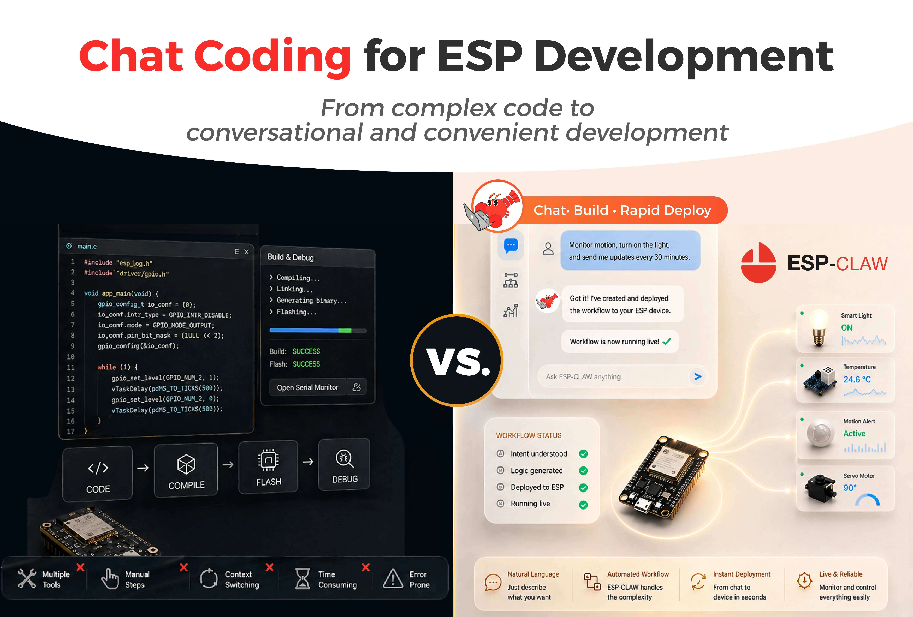
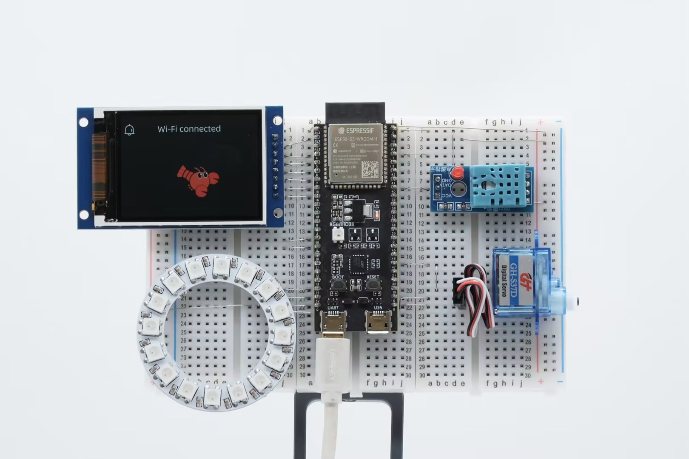

  <a href="https://esp-claw.com/en/">
    <picture>
      <source media="(prefers-color-scheme: dark)" srcset="./docs/src/assets/logos/logo-f.svg" />
      <source media="(prefers-color-scheme: light)" srcset="./docs/src/assets/logos/logo.svg" />
      
    </picture>
  </a>

  <h1>ESP-Claw 🦞 AI Agent Framework for IoT Devices</h1>

  <h3>💬 Chat as Creation · 🚀 Millisecond Response · 🧩 Smart and Extensible · 😋 Grows with You</h3>

  

    
    
  

  <a href="https://esp-claw.com/en/">Home</a>
  |
  <a href="https://esp-claw.com/en/tutorial/">Docs</a>
  |
  <a href="https://esp-claw.com/en/flash/">Online Flashing</a>
  |
  <a href="https://esp-claw.com/en/reference-project/build-from-source/">Build from Source</a>
  |
  <a href="./README_CN.md">简体中文</a>

**ESP-Claw** is Espressif's **Chat Coding** AI agent framework for IoT devices. It defines device behavior through conversation and completes the full loop of sensing, decision-making, and execution locally on Espressif chips. Inspired by the OpenClaw concept and reimplemented in C, ESP-Claw is lightweight, intelligent, and continuously evolving. With just an ESP32-series chip that costs only a few dollars, you can experience what makes ESP-Claw so nimble.

  

## 🌟 Key Features

Traditional IoT usually stops at connectivity: devices can connect to the network, but they cannot think; they can execute commands, but they cannot make decisions. ESP-Claw brings the Agent Runtime down onto Espressif chips, turning them from passive executors into active decision-making centers.

<table align="center">
  <tr>
    <th>
 💬 Chat as Creation 
</th>
    <th>
 ⚙️ Event Driven 
</th>
  </tr>
  <tr>
    <th>
      

        IM chat + dynamic Lua loading
         
        Ordinary users can define device behavior without programming
      

    </th>
    <th>
      

        Any event can trigger the Agent Loop and more
         
        Response can be as fast as milliseconds
      

    </th>
  </tr>
  <tr>
    <th width="45%">
      <video src="https://github.com/user-attachments/assets/717a4dae-fbd3-4364-afca-2d45432f156e" />
    </th>
    <th width="45%">
      <video src="https://github.com/user-attachments/assets/5a274a4a-e1dc-4c13-81aa-fb1c22d470bf" />
    </th>
  </tr>

  <tr>
    <td colspan="2"><!-- spacer row --></td>
  </tr>

  <tr>
    <th>
 🧬 Structured Memory 
</th>
    <th>
 📤 MCP Communication 
</th>
  </tr>
  <tr>
    <th>
      

        Organize memories in a structured way
         
        Privacy stays off the cloud
      

    </th>
    <th>
      

        Supports standard MCP devices
         
        Works as both Server and Client
      

    </th>
  </tr>
  <tr>
    <th width="45%">
      <video src="https://github.com/user-attachments/assets/2c8bcaa4-3606-49d3-9b70-86ad3234d48f" />
    </th>
    <th width="45%">
      <video src="https://github.com/user-attachments/assets/b1f71cee-e428-4b92-ad7e-d7816839f866" />
    </th>
  </tr>

  <tr>
    <td colspan="2"><!-- spacer row --></td>
  </tr>

  <tr>
    <th>
 🧰 Ready Out of the Box 
</th>
    <th>
 🧩 Component Extensibility 
</th>
  </tr>
  <tr>
    <th>
      

        Quick setup with Board Manager
         
        Supports one-click flashing
      

    </th>
    <th>
      

        Every module can be trimmed as needed
         
        You can also add your own component integrations
      

    </th>
  </tr>
</table>

## 📦 Quick Start

  

ESP-Claw already supports multiple ESP32-S3-based development boards, including breadboards, M5Stack CoreS3, and more. Supported boards in [`./application/edge_agent/boards/`](./application/edge_agent/boards/) can be flashed online directly: configuration and flashing are done entirely in the browser, with no need to compile firmware locally or install a development environment first.

  

You can also build ESP-Claw locally. Please refer to the [local build documentation](https://esp-claw.com/en/tutorial/) for board adaptation, building, and flashing. Boards not listed above, as well as chips like the ESP32-P4, can also be supported through local builds and flashing.

You can find practical examples in our [documentation](https://esp-claw.com/en/tutorial/).

### Supported Platforms

  <picture>
    <source media="(prefers-color-scheme: dark)" srcset="./docs/static/claw-providers-white.webp" />
    <source media="(prefers-color-scheme: light)" srcset="./docs/static/claw-providers-black.webp" />
    
  </picture>

**LLM**: ESP-Claw now supports both OpenAI-style APIs and Anthropic-style APIs. It natively supports GPT models from OpenAI, Qwen models from Alibaba Cloud Bailian, Claude models from Anthropic, DeepSeek models from DeepSeek API, and also supports custom endpoints.

> [!TIP]
>
> ESP-Claw's self-programming capability depends on models with strong tool use and instruction-following ability. We recommend `gpt-5.4`, `qwen3.6-plus`, `claude4.6-sonnet`, `deepseek-v4-pro` or models with comparable capability.

**IM**: ESP-Claw supports Telegram, QQ, Feishu, and WeChat, and can be extended further.

## Development Plan

ESP-Claw is still under active development. Feel free to open an issue to report problems or request features. You can also share your ideas through our [online survey (in Chinese)](https://fcn5wbhnyubf.feishu.cn/share/base/form/shrcndYcjbGFY1ymttTSyYoGIPh).

[Click here to view our TODO List (in Chinese)](https://fcn5wbhnyubf.feishu.cn/wiki/SRlgwWUYei4WmykU8uMcUtzTnFf?table=tblWSgzWcyW7jv7B&view=vewaP9B0KX) and vote for the features or issues you care about. That helps us prioritize them sooner.

## 📷 Follow Us

If this project helps you, please consider giving it a star. ⭐⭐⭐⭐⭐

### Star History

  <a href="https://www.star-history.com/?repos=espressif%2Fesp-claw&type=date&legend=top-left">
  <picture>
    <source media="(prefers-color-scheme: dark)" srcset="https://api.star-history.com/chart?repos=espressif/esp-claw&type=date&theme=dark&legend=top-left" />
    <source media="(prefers-color-scheme: light)" srcset="https://api.star-history.com/chart?repos=espressif/esp-claw&type=date&legend=top-left" />
    
  </picture>
  </a>

## Acknowledgements

Inspired by [OpenClaw](https://github.com/openclaw/openclaw).

The implementation of Agent Loop, IM communication, and related capabilities on ESP32 also draws on [MimiClaw](https://github.com/memovai/mimiclaw).
